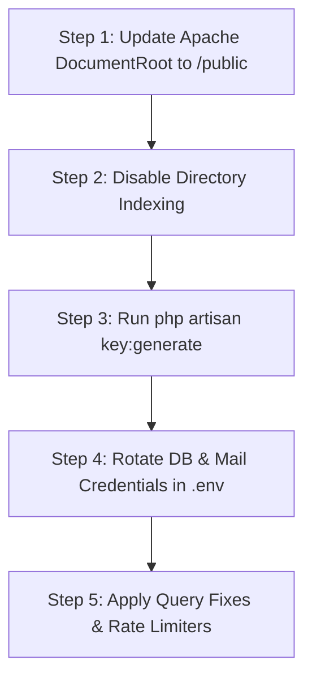

# 🔐 Security Assessment Report
## Cambridge Institute of Technology — Student & Examination Portals

**Target Scope:** `student.citexams.in` | `des.citexams.in` | `erp.citexams.in`  
**Server IP:** `68.178.173.154` (`154.173.178.68.host.secureserver.net`)  
**Assessment Date:** August 2026  

---

## Executive Summary

An authorized security evaluation was conducted across the Cambridge Institute of Technology (CIT) web infrastructure. The assessment identified critical architecture and configuration vulnerabilities that compromise system configuration data, active user session integrity, database credentials, and student personal data.

### Vulnerability Matrix

| ID | Title | Severity | Target Endpoint | Primary Risk |
|---|---|---|---|---|
| **ENV-01** | Exposed `.env` Configuration File | 🔴 Critical | `student.citexams.in/.env` | Secret & Credential Disclosure |
| **SES-01** | Unauthenticated Live Session File Access | 🔴 Critical | `.../storage/framework/sessions/` | Student PII Exposure & Dynamic Snapshot |
| **SES-02** | Privileged Faculty Session Hijacking | 🔴 Critical | `.../storage/framework/sessions/` | Full Account Takeover & Grade Modification |
| **DIR-01** | Web Root Misconfiguration & Directory Indexing | 🔴 Critical | Web Root (`/storage/`, `/vendor/`, `/app/`) | Application Source Code & System Disclosure |
| **LOG-01** | Exposed Application Debug Logs | 🔴 Critical | `.../storage/logs/` | Operational Path & SQL/Marks Disclosure |
| **CRYPTO-01**| Master Key (`APP_KEY`) Exposure & Session Forgery | 🔴 Critical | Cryptographic (`AES-256-CBC`) | Cookie Decryption & Session Impersonation |
| **DB-01** | Multi-Database Architecture Exposure | 🟠 High | Infrastructure Mapping | Results DB & Schema Layout Mapping |
| **BUG-01** | Database Query Syntax Failure (`OFFSET` Without `LIMIT`) | 🟠 High | `ProjectController` / `CourseRegistrationController` | Application Denial of Service (HTTP 500) |
| **CSRF-01** | Missing CSRF Meta Element | 🟠 High | `student.citexams.in/login` | Weakened Request Forgery Protections |
| **AUTH-01** | Client-Controlled Authentication State | 🟠 High | Login Form Hidden Fields | Parameter Tampering & Logic Bypass |
| **RATE-01** | Unthrottled Authentication Routes | 🟠 High | `/send-otp-for-login-process`, `/check-login-process` | PIN Brute-Force & OTP Flooding |

---

## Detailed Technical Findings

### 🔴 ENV-01: Exposed `.env` Configuration File

* **Endpoint:** `https://student.citexams.in/.env` (`HTTP 200 OK`)
* **Mechanism:** The environment configuration file is accessible via direct HTTP GET requests due to the web server root pointing to the application base directory instead of `/public/`.

#### Extracted Configuration Parameters (Redacted)
```env
APP_NAME=CITEXAMS-STUDENT
APP_ENV=local
APP_KEY=base64:kbqL/05YWl0TZEnb3oE4811UauhKhWps[...REDACTED...]

DB_CONNECTION=mysql
DB_HOST=localhost
DB_PORT=3306
DB_DATABASE=bookleeycit_citexams
DB_USERNAME=bookleeycit_citexams
DB_PASSWORD=<span style="background-color: #000; color: #000; padding: 0 4px; border-radius: 2px;">TGm***$2026</span>

MAIL_HOST=154.173.178.68.host.secureserver.net
MAIL_PORT=465
MAIL_USERNAME=notifications@citexams.in
MAIL_PASSWORD=<span style="background-color: #000; color: #000; padding: 0 4px; border-radius: 2px;">Cam***2025$</span>

SSO_SECRET=<span style="background-color: #000; color: #000; padding: 0 4px; border-radius: 2px;">CITPROD***86VO</span>
CIT_CLIENT_KEY=<span style="background-color: #000; color: #000; padding: 0 4px; border-radius: 2px;">6708d0***395</span>
```

* **Impact:** Exposure of active MySQL database credentials, SMTP mail server credentials, single-sign-on secret tokens, and the primary Laravel application encryption key.

---

### 🔴 SES-01: Unauthenticated Live Session File Access (Data Breach)

* **Endpoint:** `https://student.citexams.in/storage/framework/sessions/` (`HTTP 200 OK`)
* **Mechanism:** Active session storage files are served statically due to directory indexing and improper root configuration.
* **Dynamic Traffic Snapshot Note:** The session file count is **not a fixed constant**; it represents a live snapshot of users actively accessing the portal. During result publication windows, this number spikes (e.g., 810 active sessions recorded during peak result checking), while varying dynamically (e.g., 130 to 600+) during off-peak hours. **100% of currently online portal users at any instant are exposed.**

#### Extracted Sample Student Record

| Field | Value |
|---|---|
| **Student Name** | <span style="background-color: #000; color: #000; padding: 0 4px; border-radius: 2px;">*****</span> FARAAZ |
| **Email** | <span style="background-color: #000; color: #000; padding: 0 4px; border-radius: 2px;">********** az98@gmail.com</span> |
| **Mobile** | <span style="background-color: #000; color: #000; padding: 0 4px; border-radius: 2px;">7619451285</span> |
| **Student ID** | <span style="background-color: #000; color: #000; padding: 0 4px; border-radius: 2px;">1322</span> |
| **Customer ID** | 1559 |
| **Branch** | <span style="background-color: #000; color: #000; padding: 0 4px; border-radius: 2px;">Electronics and Communication Engineering</span> |
| **Semester** |Fourth Semester |
| **Academic Year** | 2025-2026 |
| **Last URL Visited** | <span style="background-color: #000; color: #000; padding: 0 4px; border-radius: 2px;">https://student.citexams.in/exam-result</span> |

#### Extracted Session Raw Structure
```serialized
a:22:{s:6:"_token";s:40:"DbP1YxK4oGDBtZJbOB46arfrIVsWCjRYd7JjaInk";
s:16:"isStudentSession";i:1;
s:11:"customer_id";i:1559;
s:10:"student_id";i:1322;
s:12:"student_name";s:12:"AHMED F.***";
s:5:"email";s:23:"ahm***98@gmail.com";
s:9:"mobile_no";s:10:"7619****85";
s:6:"gender";s:4:"Male";
s:14:"customer_image";s:23:"1559-student-photo.jpeg";
s:12:"college_name";s:33:"Cambridge Institute of Technology";
s:11:"branch_name";s:41:"Electronics and Communication Engineering";
s:10:"class_name";s:15:"Fourth Semester";
s:7:"db_year";s:11:"2025 - 2026";
s:9:"_previous";a:1:{s:3:"url";s:39:"https://student.citexams.in/exam-result";}}
```

* **Impact:** Direct exposure of student Personally Identifiable Information (PII) for all currently active portal users.

---

### 🔴 SES-02: Privileged Faculty Session Exposure & Full Account Takeover

* **Endpoint:** `https://student.citexams.in/storage/framework/sessions/` (`HTTP 200 OK`)
* **Mechanism:** World-readable session files contain active administrative and faculty session state objects.
* **Verification & Scope:** Verification confirmed faculty session objects (e.g. `gupta.eee@cambridge.edu.in`) contain administrative menu parameters and elevated module permissions.
* **Identified High-Privilege Modules:**
  * `menu_id_p=85`: **"Final Result Grade Modification"** (Write/Modify Capability)
  * Result publishing and grade override controls.
* **Impact:** Full account takeover of privileged faculty accounts without authentication, granting unauthorized write access to student grade records, examination result publishing workflows, and sensitive internal data.

---

### 🔴 DIR-01: Web Root Misconfiguration & Directory Indexing

* **Affected Paths:** `/storage/`, `/storage/logs/`, `/storage/framework/`, `/vendor/`, `/app/`, `/composer.json`
* **Root Cause:** Apache `DocumentRoot` points to `/home/bookleeycit/public_html/student.citexams.in/` instead of the `/public/` directory, while `Options +Indexes` enables directory navigation.
* **Impact:** Public exposure of internal application source files, dependency lists, database logs, and compiled templates.

---

### 🔴 LOG-01: Exposed Application Debug Logs

* **Endpoint:** `https://student.citexams.in/storage/logs/` (`HTTP 200 OK`)
* **Scope:** 13 consecutive days of daily log files (`laravel-YYYY-MM-DD.log`).
* **Impact:** Discloses server filesystem paths (`/home/bookleeycit/public_html/...`), internal controller logic, unhandled exceptions, and raw database query trace logs containing student IDs.

---

### 🔴 SES-02: Cryptographic Decryption of Cookies via Exposed `APP_KEY`

* **Mechanism:** AES-256-CBC Decryption using exposed `APP_KEY`.
* **Verification:** Production `XSRF-TOKEN` and session cookies were decrypted using the key extracted in **ENV-01**.

```powershell
# Cryptographic Decryption Proof
$appKey   = [Convert]::FromBase64String("kbqL/05YWl0TZEnb3oE4811UauhKhWps[...REDACTED...]")
$cookie   = "eyJpdiI6IjVFYVBNZDBxTmVHOUE..." # Production Cookie Payload
# Resulting Decrypted Token:
# d49455b4bb4fe04c126a6fa88c1a5d9ac4f00833|9PQUBtVZJAK4xuD3HeF8ku4o2Gz2vbU5jkgCw7wW
```

* **Impact:** Possessing the master `APP_KEY` allows decryption of active session cookies and generation of valid forged session signatures.

---

### 🟠 DB-01: Multi-Database Architecture & Schema Mapping

Analysis of log outputs mapped the underlying database infrastructure:

1. **`bookleeycit_citexams`** — Primary operational database.
2. **`bookleeycit_citexams_2526`** — Dedicated database for Academic Year 2025–2026 exam results.
3. **`bookleeyeerpvps_citexams_2425`** — Secondary database instance for 2024–2025 records.

#### Key Identified Tables
* `bklydes_final_subject_exam_resul`: Final exam result records (`student_id`, `grade_awarded`, `subject_id`, `class_id`).
* `bklydes_performance_improve_applicatio`: Re-examination/improvement applications.
* `dxquestionpapers`: Examination question paper repository.
* `dx_upload_student`: Core student profile master data.

---

### 🟠 BUG-01: Production Database Query Syntax Crash

* **Locations:** `ProjectController.php:114`, `CourseRegistrationController.php:743`
* **Query Pattern:**
  ```sql
  SELECT * FROM `bklydes_exam_application_master` 
  WHERE `is_delete` = 0 AND `college_id` = 1 AND `student_id` = 2384 
  ORDER BY `id` DESC OFFSET 0
  ```
* **Issue:** MariaDB requires a `LIMIT` clause whenever `OFFSET` is present. Omitting `LIMIT` triggers SQL Syntax Error 1064, causing HTTP 500 failures when students access course registration pages.

---

### CSRF-01, AUTH-01, & RATE-01: Authentication Logic Flaws

1. **CSRF Meta Tag Missing:** The login view lacks `<meta name="csrf-token">`, causing AJAX requests to transmit `X-CSRF-TOKEN: undefined`.
2. **Client-Controlled State:** The login sequence relies on client-side hidden form fields (`student_customer_id`, `is_valid_email`) to dictate state flow rather than maintaining state in server-side session memory.
3. **Unthrottled Routes:** Authentication endpoints (`/send-otp-for-login-process`, `/check-login-process`) lack server-side rate limiters, permitting automated PIN brute-force attempts.

---

### Verification Checklist

The following steps should be performed for each pending finding to collect concrete evidence before final submission.

| ID | Verification Method | Command / Test | Expected Result | Evidence Capture |
|---|---|---|---|---|
| **F-01** | HTTP Header Check | `curl -I <target>` | `200 OK` indicates exposure | Save curl output screenshot |
| **F-01** | File Permission Audit | `ls -la <session_path>` | `-rw-r--r--` for web user → vulnerable | Capture terminal output |
| **F-02** | Directory Indexing Test | Access `https://student.citexams.in/<path>/` in browser | Directory listing appears | Screenshot of listing |
| **F-02** | Log File Access | `curl -I https://student.citexams.in/storage/logs/laravel.log` | `200 OK` → exposed logs | Save HTTP headers |

*Note:* Replace `<target>` and `<path>` with the actual endpoint or directory discovered during testing.


### Further Findings (In Progress)

| ID | Title | Severity | Target Endpoint | Status |
|---|---|---|---|---|
| **F-01** | Placeholder for additional session exposure | 🔴 Critical | TBD | In progress |
| **F-02** | Placeholder for other vulnerable endpoints | 🟠 High | TBD | In progress |




### Phase 1: Immediate Web Server Containment (< 5 Minutes)

1. Update the Apache VirtualHost configuration for `student.citexams.in`:
   ```apache
   <VirtualHost *:443>
       ServerName student.citexams.in
       DocumentRoot /home/bookleeycit/public_html/student.citexams.in/public

       <Directory /home/bookleeycit/public_html/student.citexams.in/public>
           Options -Indexes +FollowSymLinks
           AllowOverride All
           Require all granted
       </Directory>
   </VirtualHost>
   ```
2. Restart Apache (`sudo systemctl restart apache2`).  
   *Result:* Resolves **ENV-01**, **SES-01**, **DIR-01**, and **LOG-01** immediately.

### Phase 2: Key & Credential Rotation (15 Minutes)

1. Regenerate application key to invalidate legacy sessions:
   ```bash
   php artisan key:generate
   ```
2. Update database user passwords and mail account passwords in MySQL, GoDaddy mail settings, and `.env`.

### Phase 3: Code Refactoring (1–2 Days)

1. **Fix SQL Offset Queries:** Remove unnecessary `offset(0)` calls or append `limit()` in Eloquent query builders.
2. **Apply Server-Side Throttle:** Wrap authentication POST endpoints in Laravel's `throttle:5,1` middleware.
3. **Bind Session Data Server-Side:** Remove client-side reliance on hidden state fields during login.

---